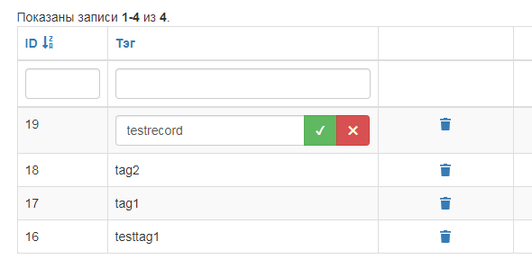

# Редактируемая колонка для GridView в Yii2

1. [Что это и зачем?](#link1)
2. [Установка](#link2)
3. [Добавление в GridView](#link3)

## 1. Что это и зачем?

Это дополнительный класс для колонки в компоненте `yii\grid\GridView` Yii2,
он наследует стандартный для GridView класс колонки `yii\grid\DataColumn` и отличается
только возможностью редактирования непосредственно в таблице. Как выглядит:

При клике на текст в ячейке этой колонки появляется поле ввода и две кнопки: применить и отмена. Данные 
на сервер отправляются аяксом.

Для работы надо установить компонент через Composer, сделать обработчик запроса AJAX, как будет описано ниже и 
присвоить выбранной колонке класс xxxgmsxxx/EditDataColumn.

## 2. Установка

Установить можно двумя способами: из репозитория на Github или из пакета

### a) Установка из репозитория на Github

 - открыть файл composer.json в корневой папке проекта
 - найти там секцию `"repositories"` и добавить в нее репозиторий:

        {
            "type": "vcs",
            "url": "https://github.com/xxxgmsxxx/yii2-edit-data-column"
        }
 - если секция `"repositories"` отсутствует - её надо создать:

        "repositories": [
            {
                "type": "vcs",
                "url": "https://github.com/xxxgmsxxx/yii2-edit-data-column"
            }
        ]

 - далее надо добавить в секцию `"require"` пакет: 

        "xxxgmsxxx/yii2-edit-data-column": "@dev"

 - зайдите в консоль и выполните 

        composer install

### b) Установка из пакета

 - зайдите в корневой каталог проекта, откройте консоль и выполните:

        composer require xxxgmsxxx/yii2-edit-data-column

- не выходя из консоли выполните

       composer install

## 3. Добавление в GridView

Для работы колонки нужно выполнить два условия:
 - настроить колонку
 - сделать обработчик на стороне сервера

Для настройки колонки необходимо задать класс колонки, опционально - адрес обработчика:

    <?= GridView::widget([
        'dataProvider' => $dataProvider,
        'filterModel'  => $searchModel,
        'columns'      => [
            [
                'attribute'     => 'tag',
                'headerOptions' => [
                    'width' => '300px',
                ],
                'class'         => xxxgmsxxx\EditDataColumn\EditDataColumn::class,
                'ajaxUrl'       => '/tags/ajax-edit',
            ],  

Если таких колонок несколько - лучше в начале скрипта добавить инструкцию use, а сам класс писать уже без пути:

    <?php
    use xxxgmsxxx\EditDataColumn\EditDataColumn;
    ?>
    ...
    <?= GridView::widget([
        'dataProvider' => $dataProvider,
        'filterModel'  => $searchModel,
        'columns'      => [
            [
                'attribute'     => 'tag',
                'headerOptions' => [
                    'width' => '300px',
                ],
                'class'         => EditDataColumn::class,
                'ajaxUrl'       => '/tags/ajax-edit',
            ],  

Адрес обработчика надо передавать в параметре `ajaxUrl`, он может быть как относительным, так и абсолютным. Если не передать 
адрес обработчика, но будет использован стандартный вида `/ajax/edit-<атрибут>`

Далее надо создать сам обработчик. Требования к обработчику:

 - он должен принимать параметры `id` и `value` - соответственно, в первом будет значение
поля id редактируемой модели, а во втором - текст из поля ввода, так же может принимать параметр `attribute` - в нём передаётся название поля
 
 - возвращать обработчик должен JSON у когорого одно обязательное поле - `result` и необязательное 
`message` Первое имеет тип boolean и указывает, удалось ли обновить данные, второе содержит расширенное
сообщение об ошибке на случай, если обновить не удалось

Пример обработчика (взят из того же проекта, что и скриншот):

    public function actionAjaxEdit()
    {
        if (!Yii::$app->request->isAjax) {
            throw new ForbiddenHttpException('Only AJAX request accept!');
        }

        $id = Yii::$app->request->post('id', false);
        if ($id === false) {
            throw new NotAcceptableHttpException('You must send "id" parameter!');
        }

        $value = Yii::$app->request->post('value', false);
        if ($value === false) {
            throw new NotAcceptableHttpException('You must send "value" parameter!');
        }

        $attribute = Yii::$app->request->post('attribute', false);
        if ($attribute === false) {
            $attribute = 'tag';
        }

        $model = Tags::findOne(['id' => $id]);

        $result = [
            'result'  => true,
            'message' => '',
        ];

        if (!$model) {
            $result = [
                'result'  => false,
                'message' => 'Model not found!',
            ];
        } else {
            $model->$attribute = $value;
            if (!$model->save()) {
                $result = [
                    'result'  => false,
                    'message' => 'Error on save' . ($model->hasErrors($attribute) ? '!' : ': ' . $model->getFirstError($attribute)),
                ];
            }
        }

        return json_encode($result);
    } 

Классы для кнопок и их содержимое пока не меняются, это в планах. 
